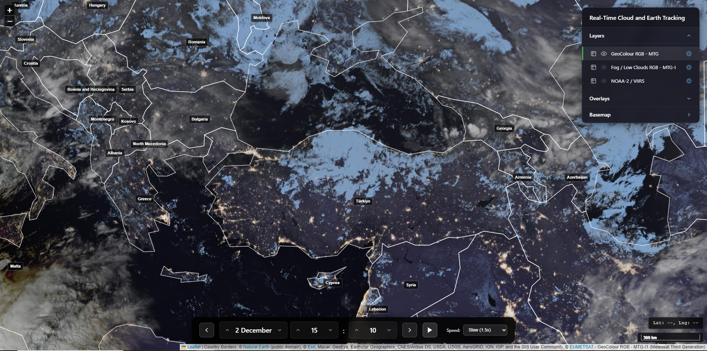

# Real-Time Cloud and Earth Tracking System



**Satellite imagery visualization system with 10-minute and 1-day time series**

An interactive satellite imagery viewing system with a modern and user-friendly web interface for cloud and earth surface tracking. The system provides 3 different satellite layers and offers access to historical data with 10-minute and 1-day temporal resolution through a central time control panel.

## Interface Features

### Layer Panel (Left Side)
- **3 Different Satellite Layers:**
  - GeoColour RGB - MTG (10-minute updates)
  - Fog / Low Clouds RGB - MTG-I (10-minute updates, 3-hour delayed)
  - NOAA-2 / VIIRS (1-day updates, 250m high resolution)
- **Overlay Layers:** Country borders and country names
- **Basemap Options:** Satellite imagery and OpenStreetMap
- Information icon (ℹ️) next to each layer for detailed technical information

### Time Control Panel (Bottom Center)
- **Time Navigation:** Move forward/backward in 10-minute intervals
- **Day/Hour/Minute Controls:** Navigate separately by day, hour, and 5-minute increments
- **Play/Pause:** Automatic time series animation
- **UTC+0 Time Display:** All time information in UTC+0 format

### Map View
- **Interactive Map:** Pan, zoom, and touch screen support
- **Layer Management:** Create different views by toggling layers on/off
- **High Performance:** Fast tile loading and smooth animations


## Features

### Satellite Layers
- **GeoColour RGB - MTG**: Natural color imagery from Meteosat Third Generation satellite (10-minute updates)
- **Fog / Low Clouds RGB - MTG-I**: Special RGB composite for fog and low cloud detection (10-minute updates, 3-hour delayed)
- **NOAA-2 / VIIRS**: High-resolution (250m) daily global coverage

### Time Series Control
- **10-Minute Resolution**: Time navigation in 10-minute intervals for EUMETSAT layers
- **1-Day Resolution**: Daily data access for VIIRS layer
- **Automatic Animation**: Time series animation with play/pause
- **UTC+0 Time Display**: All time information in UTC+0 format

### Interface Features
- **Layer Panel**: Layer management and visibility control on the left side
- **Time Control Panel**: Central time navigation controls at the bottom center
- **Information Modals**: Detailed technical information and source details for each layer
- **Overlay Layers**: Country borders and names
- **Multiple Basemaps**: Satellite imagery and OpenStreetMap options


## Technology Stack

### Core Technologies
- **HTML5** - Structure and markup
- **CSS3** - Styling and responsive design
- **JavaScript (ES6+)** - Application logic and interactivity

### Libraries and Frameworks
- **Leaflet.js** (v1.9.4) - Interactive map library
  - Provides map rendering, layer management, and user interactions
  - [Leaflet Documentation](https://leafletjs.com/)

### Data Sources

#### Satellite Imagery
- **EUMETSAT** - European Organisation for the Exploitation of Meteorological Satellites
  - GeoColour RGB - MTG: [Product Page](https://data.eumetsat.int/product/EO:EUM:DAT:0913)
  - Fog / Low Clouds RGB - MTG-I: [Product Page](https://data.eumetsat.int/product/EO:EUM:DAT:1023)
  - Temporal Resolution: 10 minutes
  - Spatial Resolution: 2 km
  - Coverage: Europe, Africa, Middle East

- **NASA GIBS** - Global Imagery Browse Services
  - NOAA-2 / VIIRS: [Data Catalog](https://www.earthdata.nasa.gov/data/catalog/lancemodis-vj103mod-nrt-2.1)
  - Temporal Resolution: 1 day
  - Spatial Resolution: 250 m
  - Coverage: Global

#### Geographic Data
- **Natural Earth Data** - Public domain map data
  - Country borders: [Natural Earth](https://www.naturalearthdata.com/)
  - Accessed via: [D3 Graph Gallery Repository](https://github.com/holtzy/D3-graph-gallery)
  - License: Public Domain

#### Basemaps
- **Esri World Imagery** - Satellite basemap
  - Provider: [Esri](https://www.esri.com/)
  
- **OpenStreetMap** - Street map basemap
  - Provider: [OpenStreetMap Contributors](https://www.openstreetmap.org/)

### APIs and Services
- **EUMETSAT WMS** - Web Map Service for satellite imagery
- **NASA GIBS WMTS** - Web Map Tile Service for VIIRS data
- **GitHub Raw Content** - CDN for GeoJSON country borders data

## Installation

### Prerequisites
- A modern web browser (Chrome, Firefox, Safari, Edge)
- No server-side requirements - runs entirely client-side

### Setup

1. Clone the repository:
```bash
git clone https://github.com/yourusername/satellite-imagery-viewer.git
cd satellite-imagery-viewer
```

2. Open `index.html` in a web browser, or use a local web server:

```bash
# Using Python 3
python -m http.server 8000

# Using Node.js (http-server)
npx http-server

# Using PHP
php -S localhost:8000
```

3. Navigate to `http://localhost:8000` in your browser

## Usage

### Basic Navigation
- **Pan**: Click and drag the map
- **Zoom**: Use mouse wheel, zoom controls, or pinch gesture on touch devices
- **Time Navigation**: Use timeline controls at the bottom to navigate through time

### Layer Management
- Click on layer names in the left panel to toggle visibility
- Click the eye icon to show/hide layers
- Click the information icon (ℹ️) next to layer names for detailed information

### Timeline Controls
- **Previous/Next**: Navigate by 10-minute intervals
- **Day/Hour/Minute**: Navigate by day, hour, or 5-minute increments
- **Play/Pause**: Automatically advance through time

### Overlays
- Toggle country borders and country names from the Overlays section
- Overlays are displayed on top of all satellite layers

## Technical Details

### Coordinate Reference Systems
- **Map CRS**: EPSG:3857 (Web Mercator) - Default Leaflet CRS
- **VIIRS Layer**: EPSG:3857 (Web Mercator) - WMTS tilematrixset: GoogleMapsCompatible_Level9
- **EUMETSAT Layers**: Automatic CRS conversion via WMS service

### Time Handling
- All times displayed in **UTC+0** (Coordinated Universal Time)
- Automatic rounding to nearest 10-minute interval
- Future date protection to ensure data availability

### Browser Compatibility
- Chrome/Edge (latest)
- Firefox (latest)
- Safari (latest)
- Mobile browsers (iOS Safari, Chrome Mobile)

## Project Structure

```
satellite-imagery-viewer/
│
├── index.html          # Main HTML structure
├── app.js              # Application logic and map initialization
├── styles.css          # Styling and responsive design
├── README.md           # This file
│
└── screenshots/        # Screenshot images (add your screenshots here)
    ├── main-view.png
    ├── interface.png
    ├── layer-info.png
    ├── welcome.png
    └── timeline.png
```

## Key Features Implementation

### Layer Management
- Dynamic layer loading based on selected time
- Automatic layer refresh on time change
- Layer visibility toggling with visual feedback

### Error Handling
- Graceful handling of missing data
- User-friendly error messages
- Fallback mechanisms for data unavailability

### Performance
- Efficient tile loading and caching
- Optimized layer updates
- Smooth animations and transitions

## Limitations and Notes

### Data Availability
- **EUMETSAT Data**: May have delays (especially Fog/Low Clouds layer - 3 hour delay)
- **VIIRS Data**: Daily updates, may not be available for current day
- **Future Dates**: System automatically prevents navigation to future dates without data

### Nighttime Lights
- City lights visible in GeoColour and Fog/Low Clouds imagery are **artificially enhanced** and added during post-processing
- They are not actual light emissions captured by satellite sensors
- Included for geographic reference and visualization purposes only

### Spatial Resolution
- EUMETSAT layers: 2 km spatial resolution (lower quality but high temporal resolution)
- VIIRS layer: 250 m spatial resolution (higher quality but lower temporal resolution)

## Disclaimer

**This system is provided for informational and educational purposes only.**

The developers, data providers, and operators of this system:
- **Do not accept any responsibility** for the accuracy, completeness, or reliability of the data displayed
- **Do not guarantee** the availability, timeliness, or continuity of the service
- **Do not accept liability** for any decisions made or actions taken based on information obtained from this system
- **Do not recommend** the use of this system for critical applications, operational decision-making, navigation, aviation, emergency response, or any other high-stakes scenarios

**All responsibility for the use of this system and any consequences thereof rests entirely with the user.**

Users are advised to verify critical information through official and authoritative sources before making any decisions based on data from this system.

## License

This project is open source. Please refer to the individual licenses of:
- **Leaflet.js**: [BSD 2-Clause License](https://github.com/Leaflet/Leaflet/blob/main/LICENSE)
- **Natural Earth Data**: Public Domain
- **OpenStreetMap**: [ODbL License](https://www.openstreetmap.org/copyright)
- **EUMETSAT Data**: Subject to EUMETSAT data policy
- **NASA Data**: Subject to NASA data policy

## Contributing

Contributions are welcome! Please feel free to submit a Pull Request.

### Areas for Contribution
- Additional satellite data sources
- Performance optimizations
- UI/UX improvements
- Documentation enhancements
- Bug fixes

## Acknowledgments

- **EUMETSAT** for providing satellite imagery data
- **NASA** for providing VIIRS data through GIBS
- **Natural Earth** for public domain geographic data
- **OpenStreetMap** contributors for basemap data
- **Leaflet.js** developers for the excellent mapping library
- **Esri** for satellite basemap imagery

## Contact

For questions, issues, or suggestions, please open an issue on GitHub.

---

**Note**: This is an educational and informational tool. Always verify critical information through official sources.

